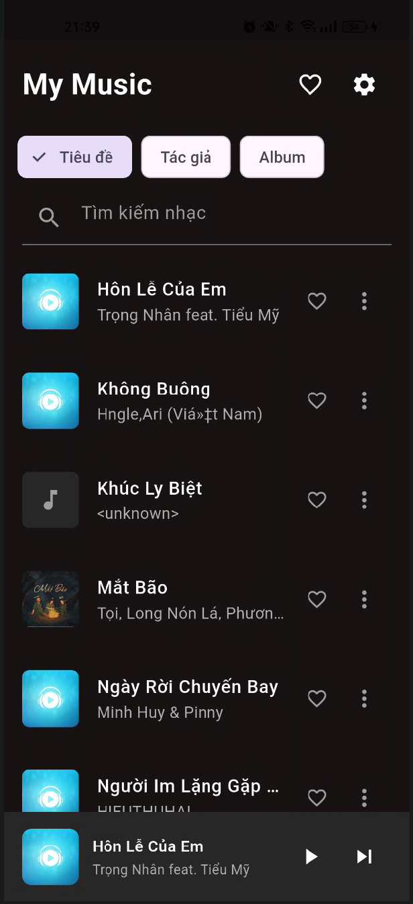
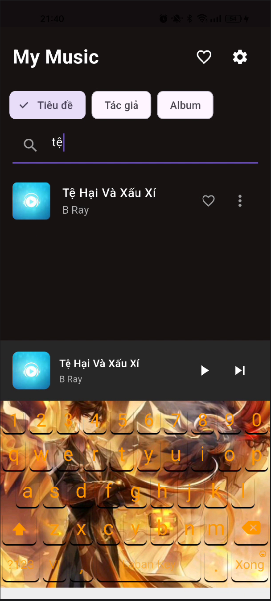
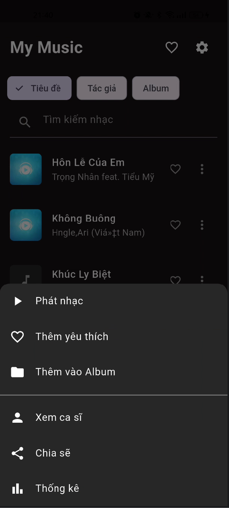
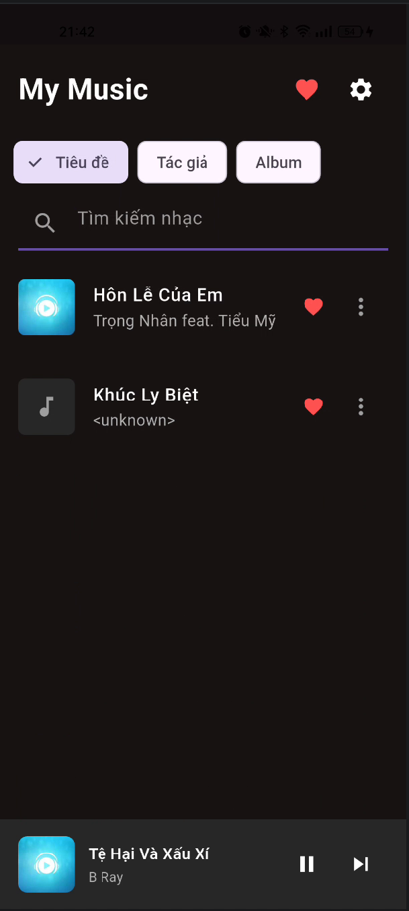
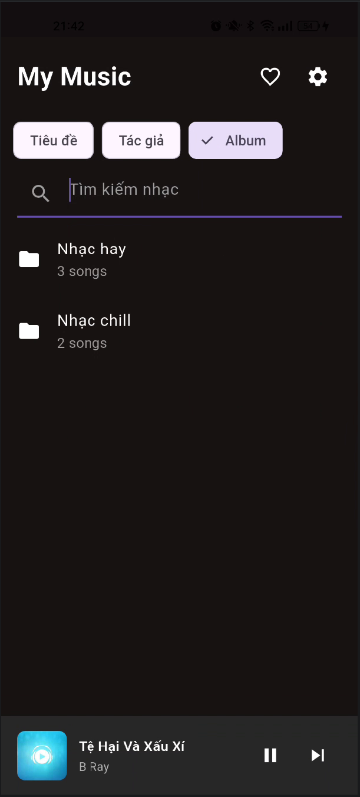
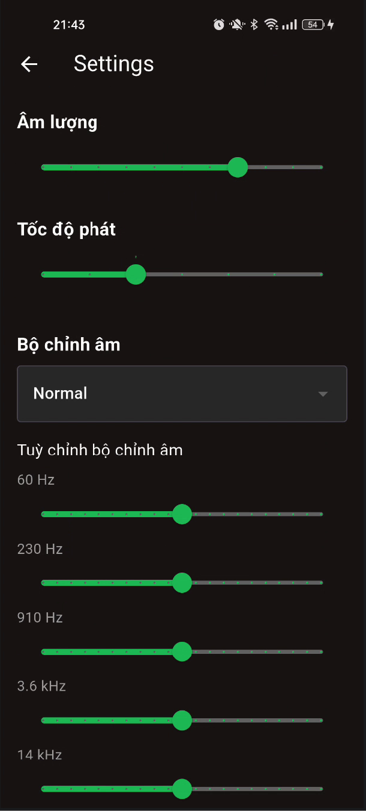
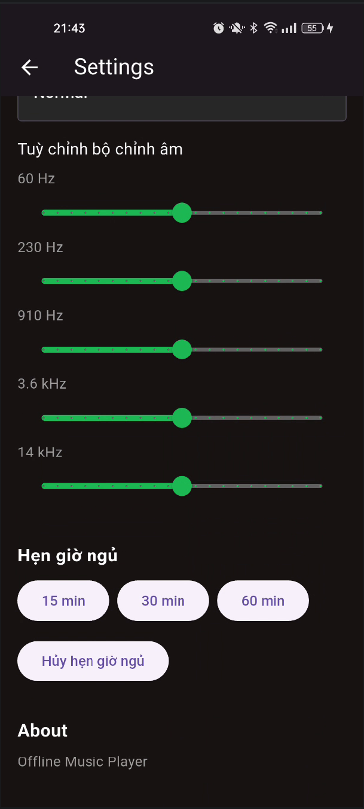

# 🎵 Offline Music Player

Ứng dụng nghe nhạc hiện đại, nhẹ nhàng và hoạt động hoàn toàn offline, phù hợp cho môi trường văn phòng.

Office Music App được phát triển bằng Flutter, sử dụng Provider để quản lý trạng thái, kết hợp SQLite / local storage để lưu trữ playlist và thông tin người dùng. Ứng dụng được thiết kế với giao diện tối giản – nhanh – trực quan, cho phép người dùng dễ dàng quản lý playlist, nghe nhạc và điều khiển phát lại.

## 🎥 Demo Video


---

## ✨ Tính năng chính

- Hiển thị toàn bộ nhạc trong thiết bị
- Phát / tạm dừng / chuyển bài
- Phát bài tiếp theo và trước đó
- Đánh dấu bài hát yêu thích
- Tìm kiếm bài hát theo:
    + Tên bài hát
    + Tác giả
    + Album
- Tạo album cá nhân
- Thêm hoặc xoá bài hát khỏi album
- Mini Player hiển thị ở cuối màn hình
- Trang cài đặt ứng dụng

## 🛠️ Công nghệ sử dụng

- Flutter
- Provider (State Management)
- On_audio_query
- Just_audio
- Permission_handler

---
## 🖼️ Giao diện ứng dụng

<table align="center" cellpadding="10" cellspacing="10">
  <tr>
    <td align="center" style="padding:10px;">
      
    </td>
    <td align="center" style="padding:10px;">
      
    </td>
    <td align="center" style="padding:10px;">
      
    </td>
    <td align="center" style="padding:10px;">
      
    </td>
  </tr>

  <tr>
    <td align="center" style="padding:10px;">
      
    </td>
    <td align="center" style="padding:10px;">>
      
    </td>
    <td align="center" style="padding:10px;">
      
    </td>
  </tr>
</table>

---

## 📂 Cấu trúc thư mục

```bash
lib/
├── models/
│   ├── playback_state_model.dart
│   ├── playlist_model.dart
│   └── song_model.dart
│
├── providers/
│   ├── audio_provider.dart
│   └── playlist_provider.dart
│
├── screens/
│   ├── home_page.dart
│   ├── now_playing_screen.dart
│   ├── all_songs_screen.dart
│   ├── playlist_screen.dart
│   └── settings_screen.dart
│
├── services/
│   ├── audio_player_service.dart
│   ├── permission_service.dart
│   ├── playlist_service.dart
│   └── storage_service.dart
│
├── widgets/
│   ├── mini_player.dart
│   ├── player_controls.dart
│   ├── progress_bar.dart
│   └── song_tile.dart
│
└── main.dart
```

## 🚀 Hướng dẫn chạy dự án

Clone project

```bash
git clone https://github.com/Noname2k4/Simple_offline_music_player_VuHoangHiep
cd note_app
```

Cài đặt dependencies và chạy ứng dụng

```bash
flutter pub get
flutter run
```
## 🔮 Hướng phát triển

Trong tương lai, ứng dụng sẽ được phát triển thêm các tính năng:
- Đồng bộ dữ liệu và playlist bằng Firebase
- Hỗ trợ phát nhạc online
- Hiển thị lời bài hát (Lyrics)
- Lưu bài hát yêu thích bằng database nội bộ
- Hiển thị ảnh bìa bài hát chất lượng cao
